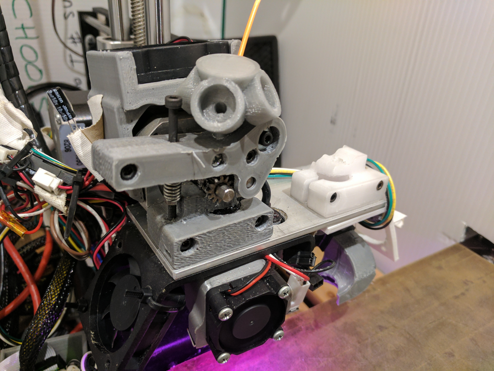
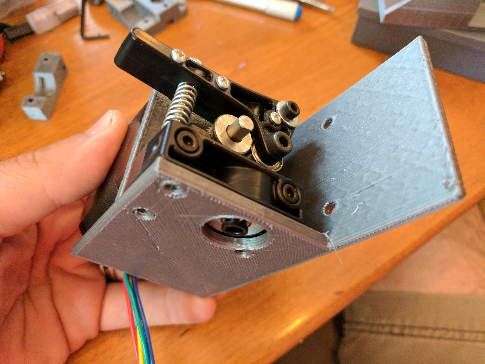
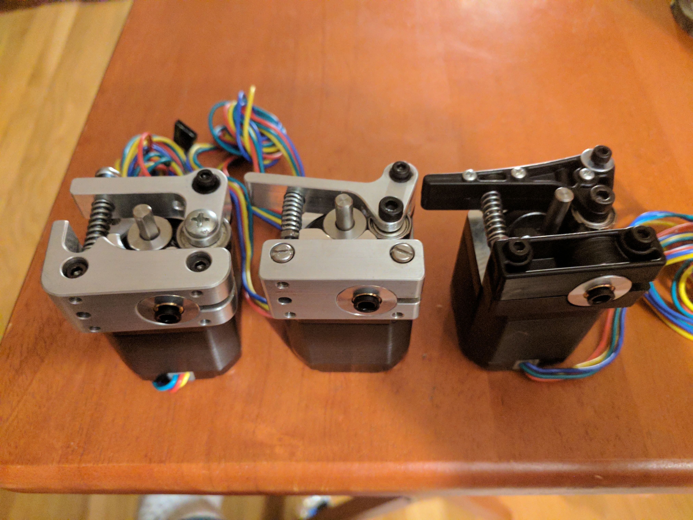
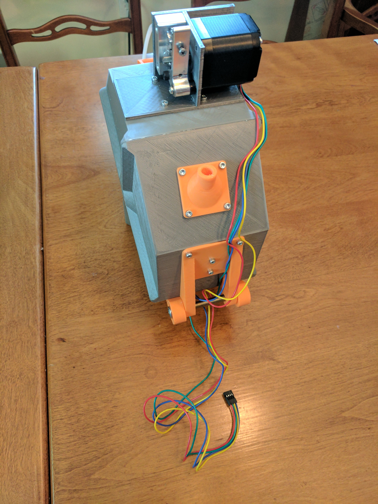
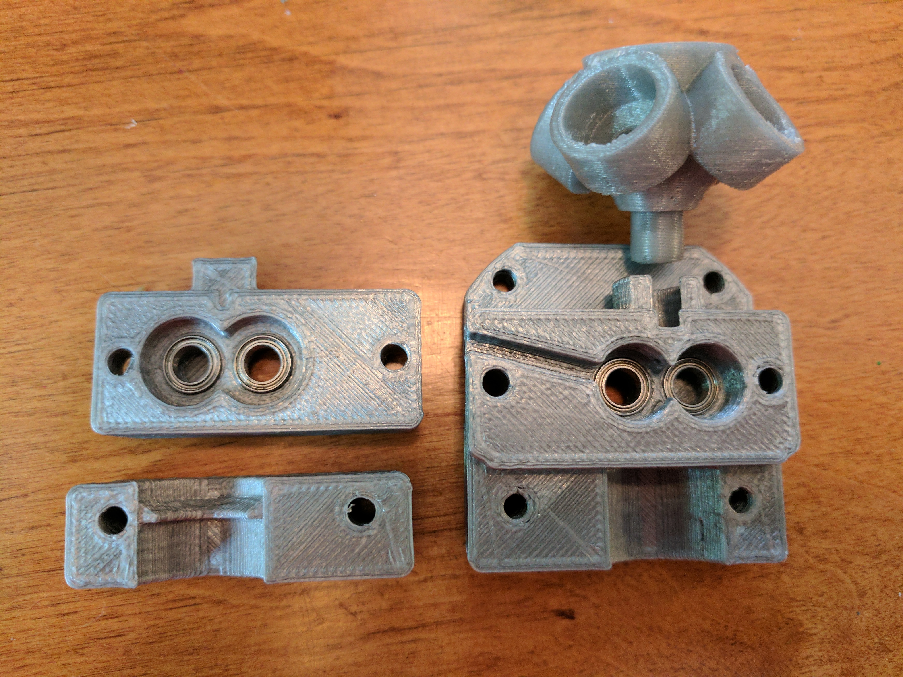
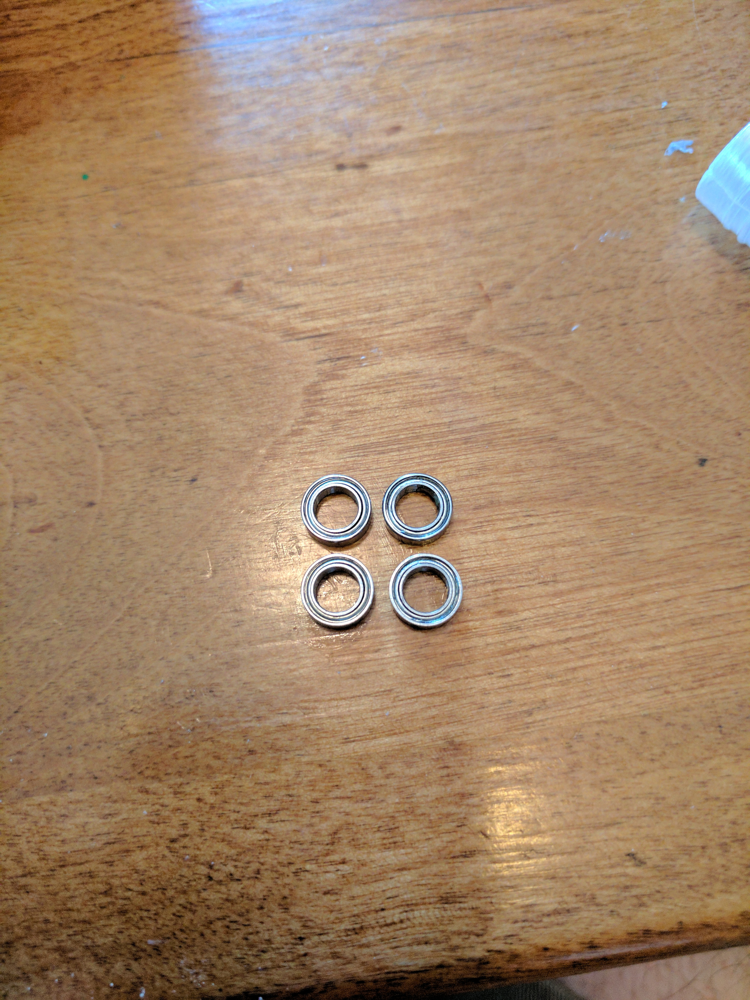
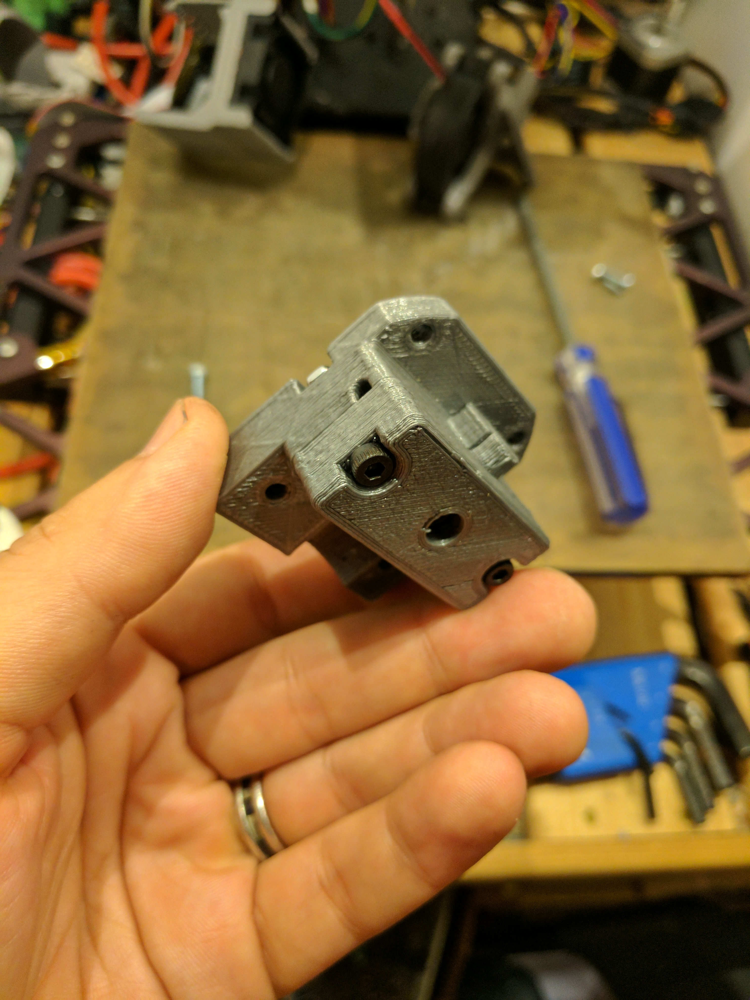
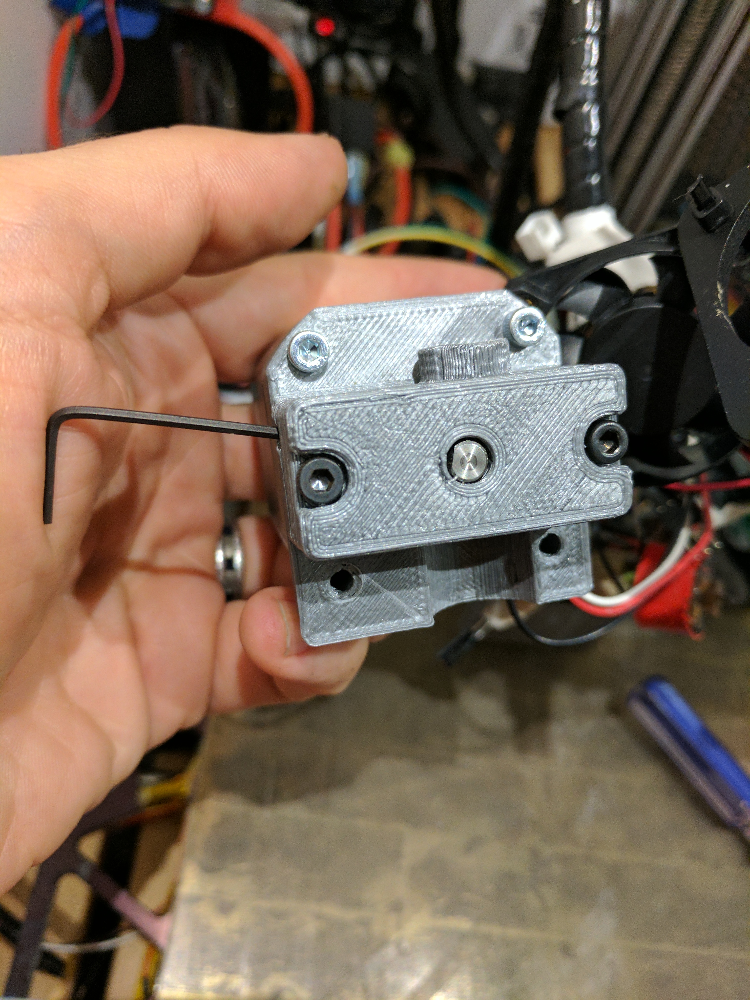
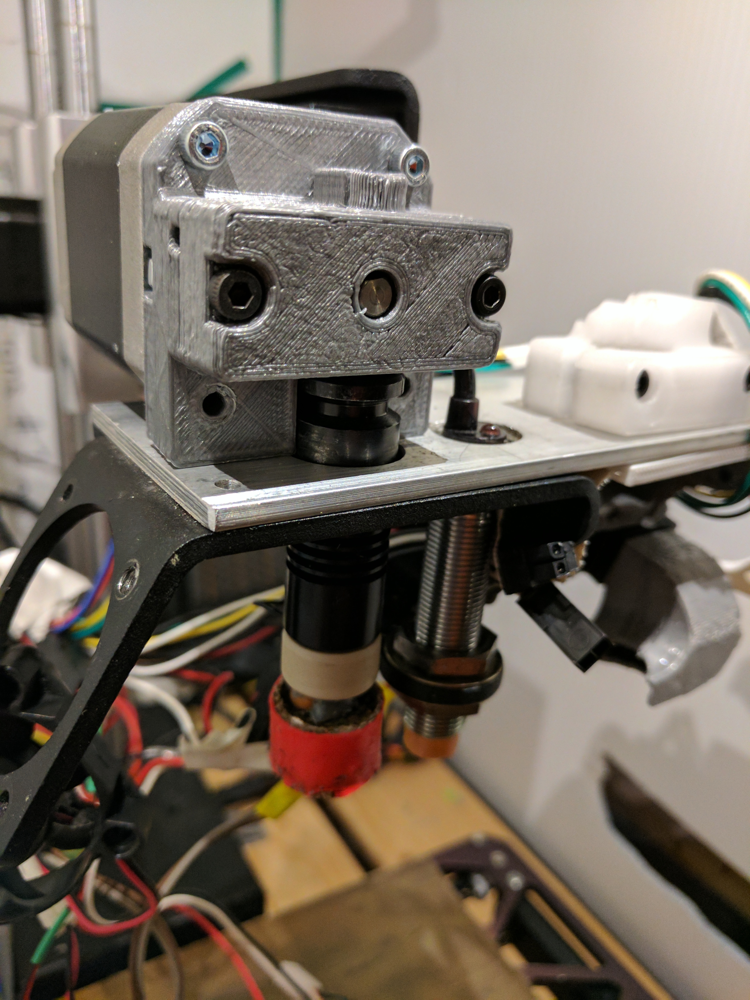
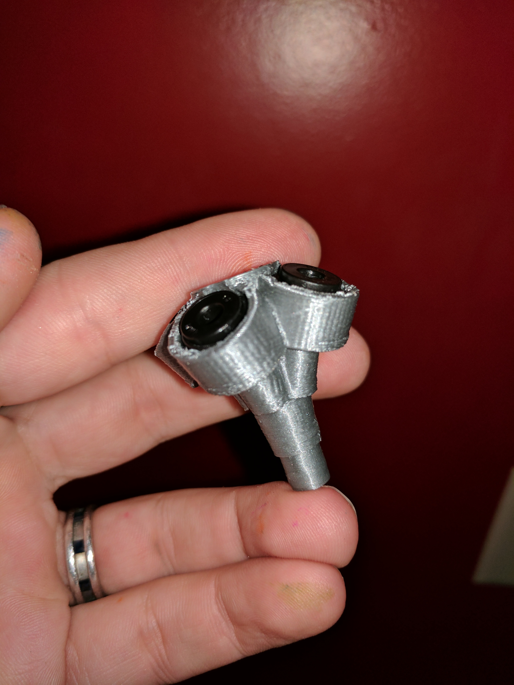

# Direct-drive multimaterial printing using Printrbot extruders

Thing tracker at
https://cscott.github.io/thing-tracker/#/thing/3367036c-9556-4aa5-b3d4-02ff7dc592d1

## Description

This repository contains a collection of parts used to implement
direct-drive multimaterial printing on a [Printrbot] Simple Metal.
It should be generalizable to other Printrbot models, and other
3d printers, but we generally use Printrbot extruder designs
and [Marlin]'s [Printrboard]/[Extrudrboard] support.  The basic
direct-drive multimaterial concept is due to [Brian Roe](http://roemotion.com)
([@MakerBrian](https://twitter.com/MakerBrian)).

The direct-drive design uses the standard extruder directly above the
hot end for precise no-lag filament control and compatibility with
flexible filaments.  It is wired up to the extruder output on the
[Printrboard] and controlled by Marlin as "Extruder 0".

We use a Printrbot [Gear Head Extruder] for direct drive, using the
fact that this extruder is self-loading: once filament is introduced
above the drive gears, the extruder will grab it and feed it through
without manual intervention.  (We're actually using the [beta version
of the gear head extruder](https://www.youmagine.com/designs/printrbot-gear-head-extruder) which used a printed housing.)

Above this direct-drive gear head extruder is a V-shaped merge adapter
which accepts 1-4 bowden tubes containing different filament
materials.  This is integrated with the housing of the gear head
extruder to place the merge as close to the extruder input as
possible.  This minimizes the distance that unsupported filament must
travel during filament changes, and thus (hopefully) prevents jams.

At the moment I've designed the merge as a single printed piece which
fits into an 8mm hole on direct-drive extruder handle or body.  The
idea is to make it easy to retrofit an existing gear-head extruder
by simply drilling an 8mm pocket in the handle, although I don't
own one of the newer Aluminum Gear Head Extruders to fully test this.

The bowden tubes from the merge piece run to individual bowden drives
mounted on filament spools.  I'm using SPANNERHANDS excellent
[spool design](https://www.thingiverse.com/thing:2119644) with a
slight remix to move the PFTE coupler and mount an extruder where
the PFTE coupler used to attach.  The extruders connect to an
[Extrudrboard] or [Extrudrboard2] and feed the filament from the
spool into the bowden tube to direct it to the merge piece.
Two extruders are always driven simultaneously to move filament,
one on the spool and one at the print head, although during
filament change operations there may be times when no filament
is actually in contact with the direct drive, and thus the
spool extruders are working alone.

The [Marlin] firmware is modified to support this style of operation,
building on the `MK2_MULTIPLEXER` support upstreamed to support Prusa's
[Super Switch](https://github.com/prusa3d/Original-Prusa-i3/issues/29).

 

## Instructions

### Step 1: Build spools

Start by printing out a [SPANNERHANDS spool] for each filament bowden
extruder you are going to use. I'm using the "v5 1kg" variant, but
with a little effort you could adapt these instructions to one of the
other spool variants.  Use [`spool-remix-lid2.stl`] instead of the
stock `LID2` part.  Mount the SPANNERHANDS `PTFE_COUPLER_v2_0.stl`
part to [`spool-remix-lid2.stl`].  We are going to mount our
bowden extruder on `LID1`, where the `PTFE_COUPLER` part would
normally go.  Assemble the `LID_Bracket`, `BASE_Bracket`,
and two `CLASP_BRACKET_v2_0` parts; I printed these in a contrasting
color.  Use two `Glue_Joint` parts to assemble the lid and base halves.
I found the stock spool bearing mounts a little too tight, so I printed
the 50mm spool at 102% to fit my 52mm-core diameter spools with the right
fit for the bearings.

 

### Step 2: Mount bowden extruders

Now print out [`mount-1kg.stl`] and attach it to the LID1 part of the
spool, with four M3-10mm screws like all of the other SPANNERHANDS
spool parts.  After it is attached to the spool you can mount the
extruder, placing the mount between the extruder body and the stepper.
I recommend M3-25mm screws here; some models of Printrbot extruder
might need some extra length to account for the mounting plate between
the extruder and stepper.

You can optionally use three M3-8mm screws to secure the bottom of
the extruder.  Some models of Printrbot extruder (for example, the
injection-molded plastic extruder) don't have these mounting holes.
They are probably overkill for this use anyway.

 

Insert a
[Groove mount 1.75mm Bowden coupler](https://www.filastruder.com/collections/e3d-spare-parts-and-accessories/products/bowden-couplings-all-types)
where the hotend would usually mount on the extruder.

 

You can route the wires for the stepper down the back of the spool and
through the hinge.  You'll probably need [servo extension cables] to
reach your Extrudrboard/Extrudrboard2 from wherever you decide to
mount your spools.  You can use [`spool-remix-hanger.stl`] to mount
the spool to the wall while leaving room for the stepper motor cable.

 

### Step 3: Assemble gear head direct-drive extruder

Print out [`gearhead-remix-base.stl`], [`gearhead-remix-clamp.stl`],
and [`gearhead-remix-gearbox.stl`]. (The photo also shows an early
version of [`bowden-block-4.stl`], the bowden merge piece.)

 

You'll also need (4) [5x8x2.5 mm ball bearings] (or just three; see
note 2 below).

 

First, install a pair of bearings into the `base` piece, and then install
the Printrbot Gear Head Extruder Gear Set into the bearings.

**NOTE 1:**
Printrbot [sells these](https://printrbot.com/shop/gear-head-extruder-gear-set/),
but the pair that I have came from the Beta program for the Gear Head Extruder.
It's possible the production gear set differs from the beta gears.

**NOTE 2:**
Printrbot's original instructions stated that the rear stepper motor
bearing (the bearing behind the hollow gear you just installed) is
optional.  But if you're buying bearings, no reason to pinch pennies.

 

Now install the other pair of bearings into the `gearbox` piece, and
bolt it to the base using (2) M3x20mm screws and (2) M3 nuts, sandwiching
the gears between them.  Before closing things up, align the set screw in
the left-hand gear with the channel in the base; this will allow you to
insert an allen wrench to tighten this gear onto the stepper shaft.

 

Attach the assembled gear box to the stepper.  Ensure the flat on the stepper
shaft is aligned with the allen wrench channel.  Use (2) M3x10mm screws in
the top holes to attach the gear box to the stepper, and then tighten the
set screw to secure the drive gear to the stepper shaft.

You probably want to use `M302 P1` to allow cold extrudes, then hook up
your stepper at this point and do a test extrusion w/o filament or hot end
in order to check that the gears turn smoothly without slipping or grinding.

 

Now attach the extruder to the Y-axis of your printer using (2) M3x10mm
screws through the bottom mounting holes into (2) M3 nuts in the slots
provided.  (I'm using M3x12mm screws because I have an extra 3mm aluminum
plate mounted to my Y-axis, to support a previous dual-extruder
experiment [similar to this one](https://www.thingiverse.com/thing:398212).)

Insert your hot end, and ensure it is snug and flush to the bottom surface
fof the extruder as shown in the picture.  Any gap here will allow flexible
coil to kink and coil into the gap, eventually pushing your hot end off in
the middle of a print.  (This is the voice of experience speaking.)

Install the `clamp` piece using two M3 screws into the stepper. (Sorry,
I didn't write down exactly how long they were; probably around 20mm.)
There is a ridge on the clamp piece that should fit into the ring at
the top of your hot end and keep it from slipping downward.  The `clamp`
is secured to the Y-axis using another M3x10mm screw and M3 nut into its
bottom.

You can do a test print, feeding filament through the hole in
the top of the remixed gear head extruder, to make sure everything
is working correctly to this point.  Be sure to use `M92 E127` to
reset your extruder steps/mm if you weren't previously using a
gear head extruder.

 

### Step 4: Install bowden merge piece

Print out [`bowden-block-4.stl`] and install (4)
[Filastruder/E3D "Embedded for plastic" 1.75mm Bowden Couplers](https://www.filastruder.com/collections/e3d-spare-parts-and-accessories/products/bowden-couplings-all-types).  (You could also use the 2-way or 3-way merge piece if
you prefer.)

To be continued...

 

### Step 5: Wire up the bowden extruder steppers
### Step 6: Update Printrboard firmware
### Step 7: Test 'er out!

## Related

* The [Extrudrboard2] design allows connecting up to four multiplexed
  steppers to a Printrboard.
* [SPANNERHANDS spool] system.
* Printrbot [Gear Head Extruder].
* [Multimaterial community forum](http://forum.monstercafe.net/topic6.html)

## License

These designs are licensed under the [GPLv2+].

[Printrbot]: http://printrbot.com
[Printrboard]: http://reprap.org/wiki/Printrboard
[Extrudrboard]: http://reprap.org/wiki/Adding_more_extruders#RAMPS_using_ExtrudrBoard
[Extrudrboard2]: https://github.com/cscott/extrudrboard2
[Marlin]: http://www.marlinfw.org/
[Gear Head Extruder]: https://printrbot.com/shop/gear-head-extruder-v2/
[SPANNERHANDS spool]: https://www.thingiverse.com/thing:2119644
[servo extension cables]: http://www.ebay.com/itm/2-3-foot-XH2-54-Long-Stepper-Motor-Extension-Cables-for-3D-Printers-5-Pieces/272523242942
[5x8x2.5mm ball bearings]: https://amazon.com/gp/product/B00ZHST8NU/
[`spool-remix-lid2.stl`]: ./spool-remix-stl/spool-remix-lid2.stl
[`spool-remix-hanger.stl`]: ./spool-remix-stl/spool-remix-hanger.stl
[`mount-1kg.stl`]: ./mount-stl/mount-1kg.stl
[`gearhead-remix-base.stl`]: ./gearhead-remix-stl/gearhead-remix-base.stl
[`gearhead-remix-clamp.stl`]: ./gearhead-remix-stl/gearhead-remix-clamp.stl
[`gearhead-remix-gearbox.stl`]: ./gearhead-remix-stl/gearhead-remix-gearbox.stl
[`bowden-block-4.stl`]: ./bowden-stl/bowden-block-4.stl
[GPLv2+]: https://spdx.org/licenses/GPL-2.0+.html
