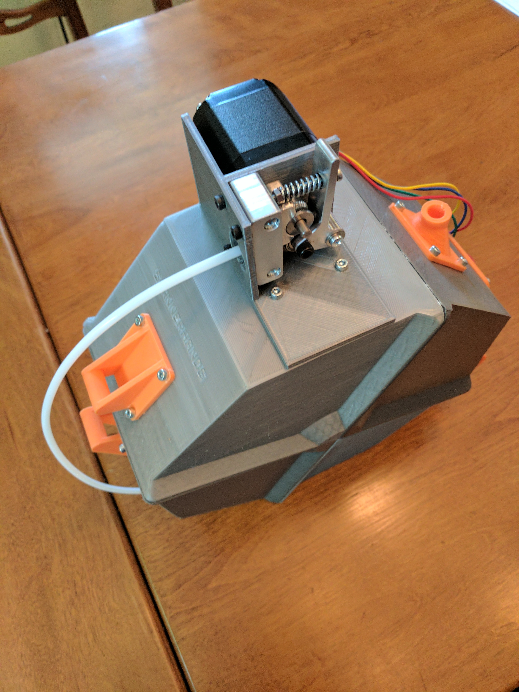

# Direct-drive multimaterial printing using Printrbot extruders

Thing tracker at
https://cscott.github.io/thing-tracker/#/thing/3367036c-9556-4aa5-b3d4-02ff7dc592d1

## Description

This repository contains a collection of parts used to implement
direct-drive multimaterial printing on a [Printrbot] Simple Metal.
It should be generalizable to other Printrbot models, and other
3d printers, but we generally use Printrbot extruder designs
and [Marlin]'s [Printrboard]/[Extrudrboard] support.

The direct-drive design uses the standard extruder directly above the
hot end for precise no-lag filament control and compatibility with
flexible filaments.  It is wired up to the extruder output on the
[Printrboard] and controlled by Marlin as "Extruder 0".

We use a Printrbot [Gear Head Extruder] for direct drive, using the
fact that this extruder is self-loading: once filament is introduced
above the drive gears, the extruder will grab it and feed it through
without manual intervention.  (We're actually using the [beta version
of the gear head extruder](https://www.youmagine.com/designs/printrbot-gear-head-extruder) which used a printed housing.)

Above this direct-drive gear head extruder is a V-shaped merge adapter
which accepts 1-4 bowden tubes containing different filament
materials.  This is integrated with the housing of the gear head
extruder to place the merge as close to the extruder input as
possible.  This minimizes the distance that unsupported filament must
travel during filament changes, and thus (hopefully) prevents jams.

At the moment I've designed the merge as a single printed piece which
fits into an 8mm hole on direct-drive extruder handle or body.  The
idea is to make it easy to retrofit an existing gear-head extruder
by simply drilling an 8mm pocket in the handle, although I don't
own one of the newer Aluminum Gear Head Extruders to fully test this.

The bowden tubes from the merge piece run to individual bowden drives
mounted on filament spools.  I'm using SPANNERHANDS excellent
[spool design](https://www.thingiverse.com/thing:2119644) with a
slight remix to move the PFTE coupler and mount an extruder where
the PFTE coupler used to attach.  The extruders connect to an
[Extrudrboard] or [Extrudrboard2] and feed the filament from the
spool into the bowden tube to direct it to the merge piece.
Two extruders are always driven simultaneously to move filament,
one on the spool and one at the print head, although during
filament change operations there may be times when no filament
is actually in contact with the direct drive, and thus the
spool extruders are working alone.

The [Marlin] firmware is modified to support this style of operation,
building on the `MK2_MULTIPLEXER` support upstreamed to support Prusa's
[Super Switch](https://github.com/prusa3d/Original-Prusa-i3/issues/29).

 

## Instructions

### Step 1: Build spools

Start by printing out a [SPANNERHANDS spool] for each filament bowden
extruder you are going to use. I'm using the "v5 1kg" variant, but
with a little effort you could adapt these instructions to one of the
other spool variants.  Use
[`spool-remix-lid2.stl`](./spool-remix-stl/spool-remix-lid2.stl)
instead of the stock LID2 part.  This just adds a new mounting location
for the SPANNERHANDS PTFE coupler, since we're going to mount our
bowden extruder on the LID1 part.

 

### Step 2: Mount bowden extruders

Now print out
[`mount-1kg.stl`](./mount-stl/mount-1kg.stl) and attach it to
the LID1 part of the spool, with four M3-10mm screws like all of the
other SPANNERHANDS spool parts.  After it is attached to the spool
you can mount the extruder, placing the mount between the extruder
body and the stepper.  I recommend M3-25mm screws here; some models
of Printrbot extruder might need some extra length to account for
the mounting plate between the extruder and stepper.
You can route the wires for the stepper down the back
of the spool and through the hinge.

You can optionally use three M3-8mm screws to secure the bottom of
the extruder.  Some models of Printrbot extruder (for example, the
injection-molded plastic extruder) don't have these mounting holes.
They are probably overkill for this use anyway.

Insert a
[Bowden coupler](https://www.filastruder.com/collections/e3d-spare-parts-and-accessories/products/bowden-couplings-all-types)
where the hotend would usually mount on the extruder.

 

### Step 3: Assemble gear head direct-drive extruder
### Step 4: Install bowden merge piece
### Step 5: Wire up the bowden extruder steppers
### Step 6: Update Printrboard firmware
### Step 7: Test 'er out!

## Related

* The [Extrudrboard2] design allows connecting up to four multiplexed
  steppers to a Printrboard.
* [SPANNERHANDS spool] system.
* Printrbot [Gear Head Extruder].
* [Multimaterial community forum](http://forum.monstercafe.net/topic6.html)

## License

These designs are licensed under the [GPLv2+].

[Printrbot]: http://printrbot.com
[Printrboard]: http://reprap.org/wiki/Printrboard
[Extrudrboard]: http://reprap.org/wiki/Adding_more_extruders#RAMPS_using_ExtrudrBoard
[Extrudrboard2]: https://github.com/cscott/extrudrboard2
[Marlin]: http://www.marlinfw.org/
[Gear Head Extruder]: https://printrbot.com/shop/gear-head-extruder-v2/
[SPANNERHANDS spool]: https://www.thingiverse.com/thing:2119644
[GPLv2+]: https://spdx.org/licenses/GPL-2.0+.html
